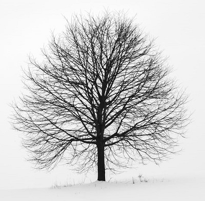

# Potrace


A "1:1 output" JavaScript port of [Potrace JS](https://github.com/kilobtye/potrace) for NodeJS.

---

| **Original image**        | **Potrace output**           |
|---------------------------|------------------------------|
|  |  |

---

[**Online Demo**](http://kilobtye.github.io/potrace/)

---

## Installation

```shell
npm install oslllo-potrace
```

## Usage

Taken from [Example.js](https://github.com/oslllo/potrace/tree/master/example)

Setup

```js
const potrace = require("oslllo-potrace");
const fs = require("fs-extra");
const path = require("path");
const sharp = require("sharp");

const source_image_path = path.resolve("example/face.jpg");
const traced_svg_path = path.resolve("example/face.svg");
```

Using `potrace.trace()`

```js
async function trace() {
    var traced_svg = await potrace.trace(source_image_path);
    fs.writeFileSync(traced_svg_path, traced_svg);
    await sharp(traced_svg_path)
        .flatten({ background: "#fff" })
        .png()
        .toFile(path.resolve("example/face.png"));
}
```

Using `potrace.loadImage()`

```js
async function loadImage() {
    var _potrace = new potrace.Potrace;
    await _potrace.loadImage(source_image_path);
    await _potrace.process();
    traced_svg = _potrace.getSVG(1);
    fs.writeFileSync(traced_svg_path, traced_svg);
    await sharp(traced_svg_path)
        .flatten({ background: "#fff" })
        .png()
        .toFile(path.resolve("example/face.png"));
}
```

## API

- `potrace.trace(file, options)`: load image from `path` or `Buffer` API, process it then return its traced SVG data.
- `potrace.loadImage(file, options)`: load image from `path` or `Buffer` API.
- `potrace.setParameter({para1: value, ...})`: set parameters.
- `potrace.process()`: wait for the image be loaded, then run potrace algorithm. on image.
- `potrace.getSVG(size, opt_type)`: return a string of generated SVG image. `result_image_size` = `original_image_size` `*` `size`. Optional parameter `opt_type` can be "curve".

## Parameters

Parameters for `potrace.setParameter()`.

- `turnpolicy`: how to resolve ambiguities in path decomposition. `TURNPOLICY_BLACK`, `TURNPOLICY_WHITE`, `TURNPOLICY_LEFT`, `TURNPOLICY_RIGHT`, `TURNPOLICY_MINORITY`, `TURNPOLICY_MAJORITY` **(default: TURNPOLICY_MINORITY)**.
- `turdsize`: suppress speckles of up to this size **(default: 2)**.
- `optcurve`: turn on/off curve optimization **(default: true)**.
- `alphamax`: corner threshold parameter **(default: 1)**.
- `opttolerance`: curve optimization tolerance **(default: 0.2)**.

## Test

```shell
npm test
```

## Credits

[Original Potrace](http://potrace.sourceforge.net/) by Peter Selinger.

[Potrace JS Port](https://github.com/kilobtye/potrace) by @kilobtye.

[Another Potrace Port For Node.js](https://github.com/tooolbox/node-potrace) maintained by @tooolbox.

## License

The GNU General Public License v2.0 (GPL-2.0). Please see [License File](https://github.com/oslllo/potrace/blob/master/LICENSE) for more information.
